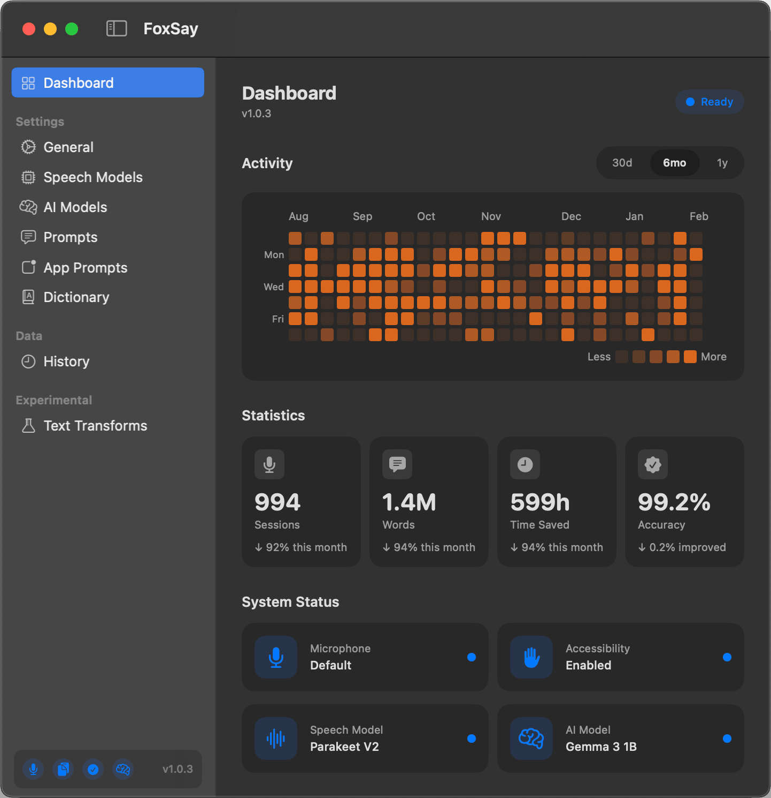

# FoxSay

A macOS mac app for on-device speech-to-text dictation, built for developers and content creators. Hold a hotkey, speak, and FoxSay transcribes your voice and pastes the result directly into any app. All processing happens locally on your Mac - no cloud services, no data leaving your machine.



## Features

- **On-device transcription** using NVIDIA Parakeet (via FluidAudio) or OpenAI Whisper (via WhisperKit)
- **Hold-to-talk hotkey** with configurable modifier keys and activation modes (hold, toggle, double-tap)
- **Voice modes** for context-aware dictation for Markdown
- **LLM-powered corrections** using local AI models (Qwen, Gemma, Llama, Phi, Mistral) via Apple MLX
- **Automatic text injection** into the frontmost app via paste
- **Transcription history** with audio playback

## Requirements

- macOS 14.0+
- Apple Silicon Mac (for Neural Engine acceleration)
- Xcode 16+

## Building

Open the workspace in Xcode and build:

```bash
open FoxSay.xcworkspace
```

The workspace includes:
- `FoxSay.xcodeproj` - the app target
- `FoxSayPackage` - Swift package containing all feature code

## Architecture

### How Transcription Works

```
Microphone → AVAudioEngine (16kHz mono) → TranscriptionEngine → CorrectionPipeline → TextInjector → Target App
```

1. **Audio capture**: `AudioEngine` records via `AVAudioEngine` with a tap on the input node, collecting 16kHz mono float samples into a thread-safe buffer.

2. **Transcription**: The audio buffer is passed to whichever `TranscriptionEngine` implementation is selected. Parakeet uses NVIDIA's TDT (Time-Domain Transducer) model accelerated on Apple Neural Engine via CoreML. Whisper uses OpenAI's Whisper models via WhisperKit.

3. **Correction pipeline**: A multi-stage pipeline processes the raw transcript:
   - **Mode detection** - identifies voice mode triggers (e.g. saying "markdown" activates Markdown mode)
   - **Pre-processing** - converts spoken commands to symbols ("hash hash" to "##", "bold on/off" to "**", etc.)
   - **LLM/rule-based correction** - optionally applies Qwen2.5-Coder-1.5B for context-aware cleanup, with rule-based fallback
   - **Post-processing** - collapses consecutive symbols, trims whitespace

4. **Text injection**: `TextInjector` copies the result to the pasteboard and simulates Cmd+V via `CGEvent` to paste into the frontmost app.

### Transcription Engines

FoxSay uses a protocol-based engine system (`TranscriptionEngine`) with two implementations:

| Engine | Library | Models | Size |
|--------|---------|--------|------|
| **Parakeet** | FluidAudio | V2 (English), V3 (25 languages) | ~450-480 MB |
| **Whisper** | WhisperKit | tiny, base, small, large-turbo | 39-809 MB |

`ModelManager` handles engine selection, model downloads, and routing transcription requests to the active engine. Models are stored in `~/Library/Application Support/`.

### Apple Silicon Acceleration

All transcription engines are optimized to fully utilize Apple Silicon hardware acceleration:

**Parakeet (FluidAudio)**
- All inference runs on Apple Neural Engine (ANE) via CoreML
- Uses `.cpuAndNeuralEngine` compute units for maximum throughput
- Achieves real-time factor of 0.02-0.05x (20-50x faster than real-time)

**Whisper (WhisperKit)**
- Explicitly configured for Neural Engine acceleration with optimized `ModelComputeOptions`:
  - Mel spectrogram extraction: CPU + Neural Engine
  - Audio encoder: CPU + Neural Engine
  - Text decoder: CPU + Neural Engine
  - Prefill: CPU + Neural Engine
- CoreML models are compiled for ANE execution
- Large-v3-turbo achieves up to 72x real-time on M2 Ultra with GPU+ANE config

**LLM Corrections (MLX)**
- All AI models run on Metal GPU via Apple MLX framework
- Available models include Qwen, Gemma, Llama, Phi, and Mistral (ranging from 1B to 12B parameters)
- 4-bit quantization reduces memory footprint while maintaining quality
- Unified memory architecture enables efficient CPU-GPU data sharing

The combination of Neural Engine for speech recognition and Metal GPU for LLM inference allows FoxSay to run multiple AI models simultaneously with minimal power consumption.

### Parakeet Engine Details

Parakeet is the default and recommended engine. It uses NVIDIA's Parakeet TDT 0.6B model converted to CoreML format for on-device inference:

- **FluidAudio** (`FluidInference/FluidAudio`) provides the Swift interface to the CoreML model
- Model files are downloaded on first use via `AsrModels.downloadAndLoad()`
- Audio buffers are pre-padded to minimum 240K samples (workaround for a FluidAudio bug with trailing punctuation on short audio)
- Transcription runs via `AsrManager.transcribe()` which returns text with confidence scores

### LLM Correction System

When enabled, FoxSay runs a local LLM for post-transcription corrections:

- **Models**: Choose from multiple models (Qwen, Gemma, Llama, Phi, Mistral) ranging from 1B to 12B parameters
- **Framework**: Apple MLX via `mlx-swift-lm` with Metal GPU acceleration
- **Quantization**: All models use 4-bit quantization for reduced memory footprint
- **Purpose**: Context-aware corrections using mode-specific prompts (e.g. fixing code syntax in JavaScript mode)

Available AI models:
| Model | Size | Notes |
|-------|------|-------|
| Gemma 3 1B | 733 MB | Google's compact QAT model |
| Qwen 2.5 1.5B | 900 MB | Fast, general-purpose |
| Qwen 2.5 Coder 1.5B | 900 MB | Optimized for code |
| Gemma 2 2B | 1.4 GB | Memory efficient |
| Qwen 2.5 3B | 1.8 GB | Balanced performance |
| Qwen 2.5 Coder 3B | 1.8 GB | Better code handling |
| Llama 3.2 3B | 1.9 GB | Meta's latest small model |
| Phi 4 Mini (3.8B) | 2.3 GB | Excellent reasoning |
| Mistral NeMo 12B | 7 GB | Highest quality |

### Voice Modes

Voice modes change how spoken text is interpreted. Activate by saying the mode name at the start of your dictation:

| Mode | Trigger | Purpose |
|------|---------|---------|
| Markdown | "markdown" / "md" | Converts voice commands to Markdown syntax |

In Markdown mode, spoken commands like "h2", "bold on/off", "bullet", "code block python", and many others are converted to their Markdown equivalents. See `FoxSayPackage/Docs/MarkdownVoiceCommands.md` for the full reference.

### Hotkey System

`HotkeyManager` uses `NSEvent.addGlobalMonitorForEvents()` to detect modifier key presses globally without requiring Accessibility permissions (Accessibility is only needed for the paste injection step).

Activation modes:
- **Hold** - record while key is held
- **Toggle** - tap to start, tap to stop
- **Double-tap** - double-tap to start/stop
- **Hold or Toggle** - auto-detects based on press duration (default 0.3s threshold)

Escape key cancels an in-progress recording.

### Project Structure

```
FoxSay/                          # App target
  FoxSayApp.swift                # @main entry point, AppDelegate, window setup
  Assets.xcassets/               # App icons, menu bar icon, colors

FoxSayPackage/                   # Swift package with all feature code
  Sources/FoxSayFeature/
    Core/
      AudioEngine.swift          # AVAudioEngine recording, 16kHz conversion
      AppDetector.swift          # Frontmost app monitoring
      HotkeyManager.swift        # Global hotkey detection
      MenuBarManager.swift       # NSStatusItem menu bar icon
      TextInjector.swift         # Pasteboard + CGEvent paste injection
      SoundEffectManager.swift   # Audio feedback for overlay open/close
      HistoryManager.swift       # Transcription history persistence
    Engines/
      TranscriptionEngine.swift  # Protocol definition
      ParakeetEngine.swift       # FluidAudio / Parakeet TDT
      WhisperKitEngine.swift     # WhisperKit / Whisper
      EngineManager.swift        # Model selection and routing
    Processing/
      CorrectionPipeline.swift   # Multi-stage text processing
      LLMCorrector.swift         # LLM inference for corrections
      LLMModelManager.swift      # Qwen model download and management
      RuleBasedCorrector.swift   # Regex/pattern corrections
      VoiceModeManager.swift     # Voice mode detection and prompts
    Models/
      AppState.swift             # Central app state (@MainActor singleton)
      TranscriptionResult.swift  # Transcription output model
      DevAppConfig.swift         # Developer app whitelist config
    Views/
      MainWindowView.swift       # Main window with sidebar
      ContentView.swift          # Status display
      OverlayView.swift          # Floating recording indicator
      SettingsView.swift         # Settings navigation
      HistoryView.swift          # Transcription history
      SetupWizardView.swift      # First-launch setup
      ...
    Resources/
      overlay-open.wav           # Sound effects
      overlay-close.wav
  Docs/
    MarkdownVoiceCommands.md     # Voice command reference
```

### Dependencies

| Package | Source | Purpose |
|---------|--------|---------|
| WhisperKit | `argmaxinc/WhisperKit` (v0.12.0+) | Whisper speech recognition |
| FluidAudio | `FluidInference/FluidAudio` (v0.10.0+) | Parakeet speech recognition |
| mlx-swift-lm | `ml-explore/mlx-swift-lm` (main) | Local LLM inference via Apple MLX |

## License

Apache License 2.0. See [LICENSE](LICENSE) for details.
